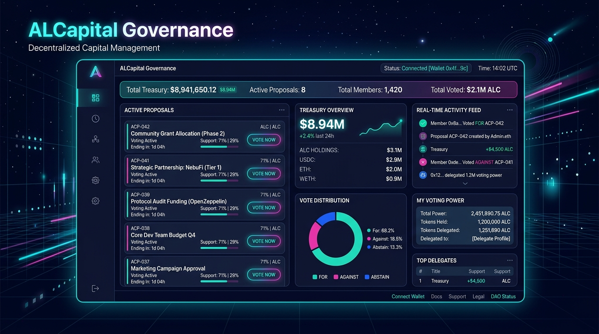
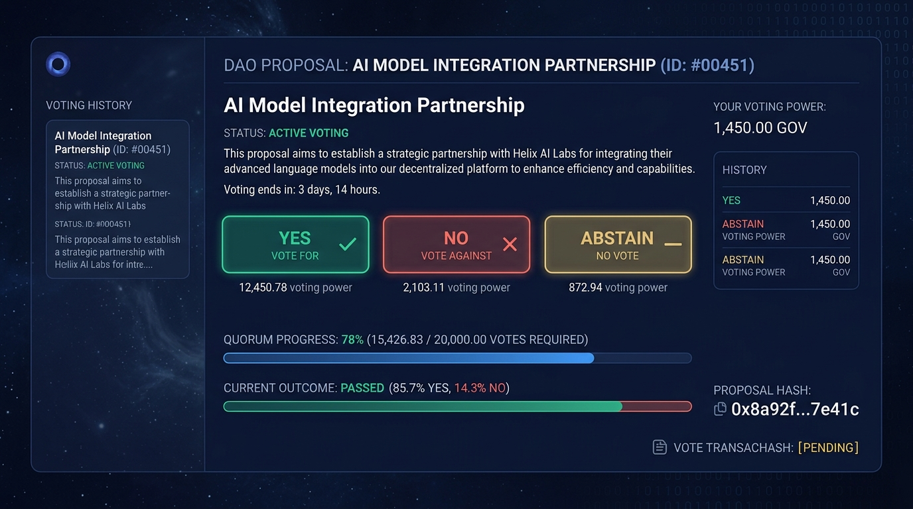
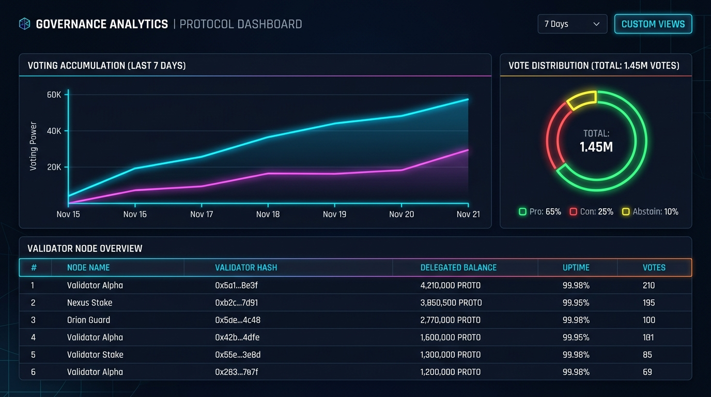
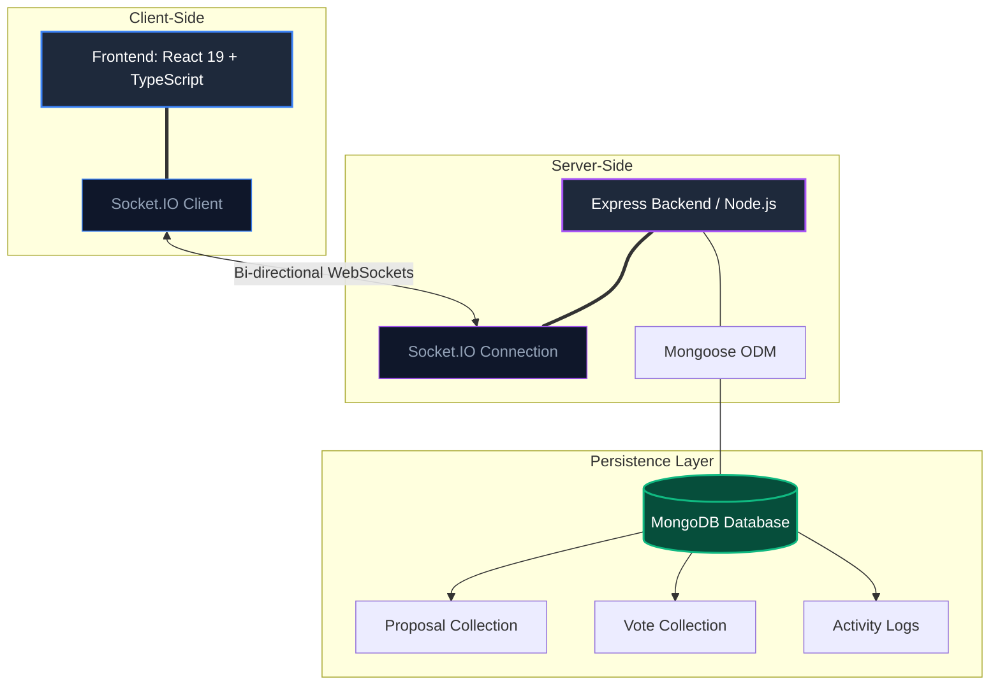

# ALCapital Governance Dashboard

[](https://opensource.org/licenses/Apache-2.0)
[](https://react.dev)
[](https://www.typescriptlang.org)
[](https://socket.io)
[](https://www.mongodb.com)
[](https://expressjs.com)

A high-performance, real-time decentralized autonomous organization (DAO) governance console and proposal tracker. This platform enables Web3 communities to draft proposals, cast cryptographic weighted simulate votes, track vote distributions via interactive charts, review real-time activity feeds, and monitor treasury cash reserves within a unified, premium dark-mode dashboard interface.

---

## 📸 Screenshots

### 1. Main Governance Dashboard
Comprehensive 3-column layout highlighting Active Proposals, Live Voting Progress Curves, Vote Distribution Donut Chart, and Real-time Activity feeds.


### 2. Proposal Voting Chamber
Detailed breakdown of chosen proposals with clear descriptions, creators' wallet addresses, live timelines, and responsive voting actions ("YES", "NO", "ABSTAIN").


### 3. Analytics & Treasury reserves
Real-time treasury asset distribution across multiple stablecoins and tokens, alongside validator leaderboard statistics.


---

## 🏗️ Architecture Diagram

The application leverages a real-time full-stack infrastructure design:



---

## ⚡ Key Features

*   **Real-time Synchronization:** Bi-directional websocket connection powered by **Socket.IO** ensures active proposals, vote aggregations, and global metrics update instantly across all active clients without manual refreshing.
*   **Web3 Identity Integration:** 
    *   Simulate Multi-User testing using a local profiles dropdown allowing quick switching between 10+ mock active validator profiles with calibrated Voting Power (VP).
    *   **MetaMask Integration:** Synchronizes actual browser-based user wallets. Reads active addresses and balances in real-time, executing on-chain simulated proof logs safely.
*   **MongoDB Persistence Layer:** Flexible schema representations of user profiles, proposals, votes, and activity telemetry with built-in Mongo server-selection fallbacks to native file JSON structures.
*   **Analytics Engine:** High-framerate interactive curves and charts rendered natively via **Chart.js** displaying vote progression timelines and proportional weight distribution.
*   **Proposal drafting Wizard:** Elegant wizard modals allowing active validators with threshold voting requirements to register new governance draft proposals, instantly indexing them.

---

## 🧪 What I Learned

Building this application provided deeply valuable insights into full-stack architecture, Web3 design paradigms, and state synchronization:

*   **Real-Time Bi-Directional Synchronization (Socket.IO):** Implementing synchronization logic spanning multiple browser contexts. I learned how to manage websocket connections, structure real-time payloads, room events, and synchronize local states across multiple user sessions using a central authority server.
*   **MongoDB Schema Design & Robust Database Mappings:** Designed data structures utilizing **Mongoose ODM** to model one-to-many relationships safely (e.g. tracking multiple unique votes cast per validator across multiple distinct proposals). I implemented a robust, seamless local JSON fallback layer to handle DB service disruptions without breaking application usability.
*   **Web3 Governance Concepts:** Gained deep analytical understanding of on-chain governance parameters, including voting power (VP) weight distribution metrics, absolute quorum margins, minimum proposal thresholds, timelocks, and multi-sig finalizations.
*   **Advanced React State Management:** Developed a scalable reactive system using React Hooks (`useMemo`, `useEffect`, `useRef`) paired with custom event communication pipelines (`BroadcastChannel` API) to ensure local frames are aligned instantly when profile sessions shift.
*   **High-Yield Dashboard Architecture:** Designed a responsive center-weighted 3-column dashboard that organizes highly complex datasets (aggregated statistics, interactive charting analytics, navigation selectors, and scrolling logger components) into a clean, low-fatigue bento interface.

---

## 🚀 Installation & Local Execution

Follow these step-by-step instructions to boot the application on your local machine:

### 1. Clone & Configuration
Clone this repository to your workspace and navigate inside:
```bash
git clone https://github.com/your-username/alcapital-governance-dashboard.git
cd alcapital-governance-dashboard
```

Create a `.env` file at the root by copying the existing template:
```bash
cp .env.example .env
```

Open `.env` and fill in your connection details:
```env
MONGODB_URI="your-mongodb-connection-string"
PORT=3000
RPC_URL="https://cloudflare-eth.com"
```

### 2. Install Project Dependencies
Run standard NPM installation to configure packages:
```bash
npm install
```

### 3. Start Development Server
Boot up the concurrent Express + Vite server at [http://localhost:3000](http://localhost:3000):
```bash
npm run dev
```

### 4. Compiling & Production Build
To create a compact, highly optimized application bundle for production:
```bash
# Compiles both Frontend assets and packages Node.js backend using esbuild
npm run build

# Start production server
npm run start
```

---

## 🔮 Future Improvements

While the application current features a fully functional mock ledger system, the following engineering integrations are planned for future milestone releases:

1.  **MetaMask EIP-712 Signatures:** Implementing digital signature challenges using browser-based providers to allow validators to sign proposals cryptographically before casting votes.
2.  **On-chain smart contract integration:** Porting proposal storage directly to decentralized networks (e.g., Ethereum, L2 Arbitrum or Base) via custom solidity contracts (GovernorAlpha or GovernorBravo structures).
3.  **Token-Weighted snapshot indexes:** Synchronizing voter weights automatically with on-chain token holding ratios or liquidity-pool LP staking indices via **The Graph** subgraphs instead of simulated values.
4.  **DAO Multi-sig Treasury controls:** Enabling auto-execution of approved budget disbursements on Gnosis Safe architectures once critical quorums are successfully validated.
